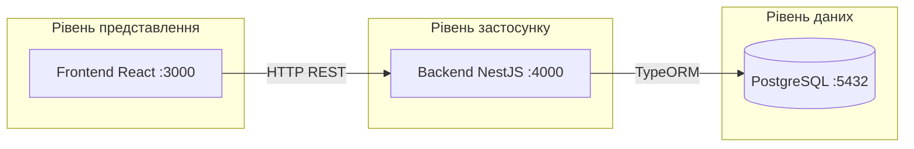
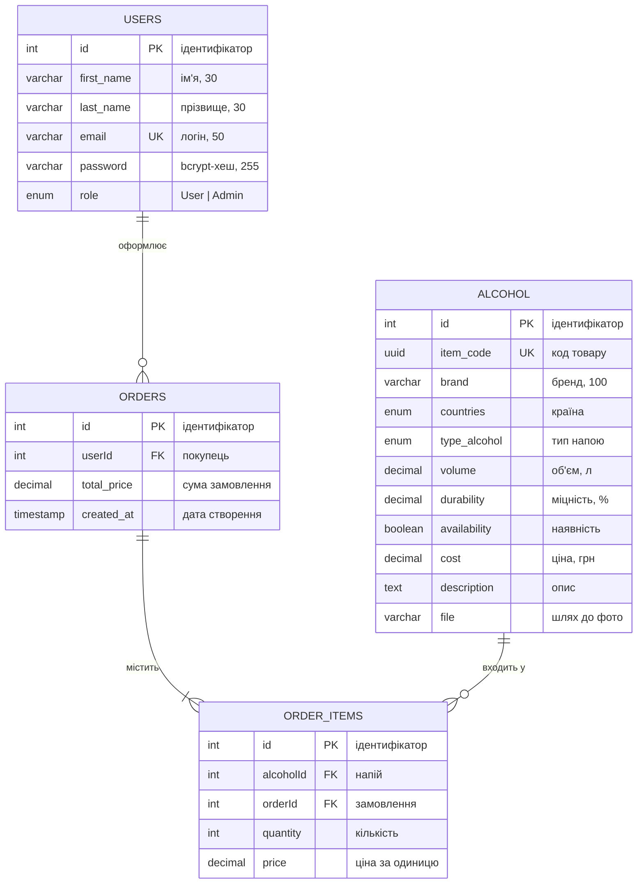

# ДОКУМЕНТАЦІЯ ПРОГРАМНОГО ЗАБЕЗПЕЧЕННЯ

## «ALCOHOL STORE» — інтернет-магазин алкогольних напоїв

---

| Реквізит | Значення |
|----------|----------|
| **Найменування документа** | Керівництво користувача та опис програмного забезпечення |
| **Найменування системи** | Alcohol Store |
| **Версія ПЗ** | 1.0 |
| **Мова реалізації** | JavaScript (ES2021) |
| **Дата складання** | 2026 |
| **Виконавець** | Степанчук Павло Анатолійович |
| **Керівник** | Чижмотря Олексій Володимирович |

---

## ІНСТРУКЦІЯ З ЗАПУСКУ

> Повний опис системи — у розділах 1–10 нижче. Тут — мінімальні кроки, щоб відкрити сайт.

**Що потрібно:** [Docker Desktop](https://www.docker.com/products/docker-desktop/) (запущений), браузер.

### Крок 1. Відкрити папку проєкту в терміналі

```powershell
cd "*(шлях замініть на свій, якщо проєкт лежить в іншому місці)*"
```


### Крок 2. Файл `.env`

У **корені** проєкту має бути файл `.env` змінними (якщо його немає — створіть):

```env
POSTGRES_DATABASE=alcohol_store
POSTGRES_USERNAME=username
POSTGRES_PASSWORD=password
JWT_SECRET=your_secret_key_here
```

### Крок 3. Запустити всі сервіси

```powershell
docker compose up --build
```

Дочекайтесь, поки в терміналі з’являться рядки про старт backend і frontend (перший раз — **5–15 хвилин**).

### Крок 4. Заповнити каталог товарами

У **новому** вікні PowerShell (Docker має працювати):

```powershell
docker exec alcohol-store-backend npm run seed
```

Якщо написано, що записи вже є — каталог уже заповнений; інакше побачите список доданих напоїв.

### Крок 5. Відкрити сайт

| Що | Адреса |
|----|--------|
| **Сайт (магазин)** | http://localhost:3000 |
| **API (перевірка)** | http://localhost:4000 |

Оновіть сторінку каталогу після seed.

### Зупинити проєкт

У терміналі з `docker compose up`: `Ctrl + C`, потім:

```powershell
docker compose down
```

### Якщо щось не працює

| Симптом | Що зробити |
|---------|------------|
| Каталог порожній | Повторити крок 4 (seed) |
| Порт зайнятий | Закрити інші програми на 3000/4000 або змінити порти в `docker-compose.yml` |
| Docker не стартує | Перевірити, що Docker Desktop увімкнено |
| Помилка БД | Перевірити `.env` у корені проєкту |

Детальніше: [розділ 6](#6-встановлення-та-налаштування), [Додаток Г](#додаток-г-типові-проблеми).

---

## ЗМІСТ

- [**Інструкція з запуску**](#інструкція-з-запуску)  
1. [Загальні відомості](#1-загальні-відомості)  
   1.1. [Призначення системи](#11-призначення-системи)  
   1.2. [Область застосування](#12-область-застосування)  
   1.3. [Склад програмного комплексу](#13-склад-програмного-комплексу)  
2. [Характеристика системи](#2-характеристика-системи)  
   2.1. [Функціональні можливості](#21-функціональні-можливості)  
   2.2. [Ролі користувачів](#22-ролі-користувачів)  
   2.3. [Обмеження та припущення](#23-обмеження-та-припущення)  
3. [Архітектура програмного забезпечення](#3-архітектура-програмного-забезпечення)  
   3.1. [Загальна структура](#31-загальна-структура)  
   3.2. [Технологічний стек](#32-технологічний-стек)  
   3.3. [Модель даних](#33-модель-даних)  
4. [Структура проєкту](#4-структура-проєкту)  
5. [Вимоги до програмно-апаратного забезпечення](#5-вимоги-до-програмно-апаратного-забезпечення)  
6. [Встановлення та налаштування](#6-встановлення-та-налаштування)  
   6.1. [Підготовка середовища](#61-підготовка-середовища)  
   6.2. [Запуск системи](#62-запуск-системи)  
7. [Експлуатація системи](#7-експлуатація-системи)  
   7.1. [Робота з веб-інтерфейсом](#71-робота-з-веб-інтерфейсом)  
   7.2. [Заповнення та супровід бази даних](#72-заповнення-та-супровід-бази-даних)  
   7.3. [Призначення адміністратора](#73-призначення-адміністратора)  
   7.4. [Робота зображеннями товарів](#74-робота-зображеннями-товарів)  
8. [Опис програмного інтерфейсу (REST API)](#8-опис-програмного-інтерфейсу-rest-api)  
   8.1. [Загальні правила](#81-загальні-правила)  
   8.2. [Перелік endpoint](#82-перелік-endpoint)  
   8.3. [Приклади запитів](#83-приклади-запитів)  
9. [Перелік умовних позначень, скорочень і термінів](#9-перелік-умовних-позначень-скорочень-і-термінів)  
10. [Додатки](#10-додатки)

---

## 1. Загальні відомості

### 1.1. Призначення системи

Програмний комплекс **Alcohol Store** призначений для автоматизації процесів перегляду каталогу алкогольних напоїв, реєстрації користувачів, оформлення замовлень та адміністрування товарів у демонстраційному інтернет-магазині.

Система складається з:

- **клієнтської частини (frontend)** — односторінковий веб-інтерфейс;
- **серверної частини (backend)** — REST API;
- **підсистеми зберігання даних** — СУБД PostgreSQL.

### 1.2. Область застосування

Система використовується як навчальний та демонстраційний проєкт для відпрацювання архітектури «клієнт — сервер», електронної комерції (каталог, кошик, замовлення, авторизація).

Система **не призначена** для реального продажу алкоголю без дотримання законодавства відповідної юрисдикції.

### 1.3. Склад програмного комплексу

**Таблиця 1 — Склад програмного комплексу**

| № | Компонент | Опис |
|---|-----------|------|
| 1 | Frontend | SPA на React, порт 3000 |
| 2 | Backend | REST API на NestJS, порт 4000 |
| 3 | PostgreSQL | Зберігання користувачів, товарів, замовлень |
| 4 | Docker Compose | Оркестрація сервісів |

**Таблиця 2 — Мережеві адреси за замовчуванням**

| Сервіс | URL |
|--------|-----|
| Веб-інтерфейс | http://localhost:3000 |
| REST API | http://localhost:4000 |
| PostgreSQL | localhost:5432 |

---

## 2. Характеристика системи

### 2.1. Функціональні можливості

**Таблиця 3 — Основні функції системи**

| № | Модуль | Функція |
|---|--------|---------|
| 1 | Каталог | Перегляд товарів, фільтрація (тип, об'єм, країна, міцність), сортування за ціною та популярністю |
| 2 | Пошук | Пошук за брендом у шапці сайту |
| 3 | Картка товару | Детальний опис, зображення, додавання в кошик |
| 4 | Кошик | Зберігання в `localStorage`, оформлення замовлення |
| 5 | Авторизація | Реєстрація, вхід, JWT-токен |
| 6 | Профіль | Перегляд і редагування даних, історія замовлень |
| 7 | Адміністрування | Видалення товарів (роль `Admin`) |

### 2.2. Ролі користувачів

**Таблиця 4 — Ролі та права доступу**

| Роль | Позначення в БД | Права |
|------|-----------------|-------|
| Користувач | `User` | Каталог, кошик, замовлення, профіль |
| Адміністратор | `Admin` | Усі права користувача + видалення товарів |

### 2.3. Обмеження та припущення

- У навчальному режимі схема БД оновлюється автоматично (`synchronize: true` у TypeORM); для промислової експлуатації слід використовувати міграції.
- Кошик зберігається локально в браузері; при очищенні даних сайту вміст кошика втрачається.
- Пароль користувача в API не повертається (зберігається лише bcrypt-хеш).

---

## 3. Архітектура програмного забезпечення

### 3.1. Загальна структура

Система побудована за **трирівневою архітектурою**:

1. рівень представлення (React);
2. рівень бізнес-логіки (NestJS);
3. рівень даних (PostgreSQL).

**Рисунок 1 — Загальна архітектура системи**



У режимі розробки frontend проксує запити на backend через `frontend/src/setupProxy.js`.

### 3.2. Технологічний стек

**Таблиця 5 — Технологічний стек**

| Шар | Технології | Примітка |
|-----|------------|----------|
| Frontend | React, React Router, Ant Design, Axios | Create React App |
| Backend | NestJS, TypeORM, class-validator, JWT, bcrypt | JavaScript |
| БД | PostgreSQL | 14+, у Docker — образ 16 |
| Інфраструктура | Docker, Docker Compose | Запуск усіх сервісів |

### 3.3. Модель даних

TypeORM створює таблиці при старті backend (`synchronize: true`).

**Рисунок 2 — Логічна модель даних (сутності та зв'язки)**



#### Таблиця `users`

**Таблиця 6 — Структура таблиці `users`**

| Колонка | Тип | Обмеження | Опис |
|---------|-----|-----------|------|
| `id` | int | PK, auto increment | Ідентифікатор користувача |
| `first_name` | varchar(30) | NOT NULL | Ім'я |
| `last_name` | varchar(30) | NOT NULL | Прізвище |
| `email` | varchar(50) | NOT NULL, UNIQUE | Email (логін) |
| `password` | varchar(255) | NOT NULL | Хеш пароля (bcrypt), у API не повертається |
| `role` | enum `UserRole` | NOT NULL, default `User` | `User` або `Admin` |

**Зв'язки:** один користувач → багато замовлень (`orders`).

#### Таблиця `alcohol`

**Таблиця 7 — Структура таблиці `alcohol`**

| Колонка | Тип | Обмеження | Опис |
|---------|-----|-----------|------|
| `id` | int | PK, auto increment | ID товару |
| `item_code` | uuid | NOT NULL, UNIQUE, auto | Код товару |
| `brand` | varchar(100) | NOT NULL | Назва бренду |
| `countries` | enum | NOT NULL | Країна виробництва |
| `type_alcohol` | enum | NOT NULL | Тип напою (див. Додаток А) |
| `volume` | decimal(10,2) | NOT NULL | Об'єм, л |
| `durability` | decimal(10,2) | NOT NULL | Міцність, % |
| `availability` | boolean | NOT NULL, default `true` | Наявність на складі |
| `cost` | decimal(10,2) | NOT NULL | Ціна, грн |
| `description` | text | NOT NULL | Текстовий опис |
| `file` | varchar(255) | NOT NULL | Шлях до фото, напр. `uploads/jameson.jpg` |

**Зв'язки:** один напій → багато позицій у `orderItems` (каскадне видалення).

#### Таблиця `orders`

**Таблиця 8 — Структура таблиці `orders`**

| Колонка | Тип | Обмеження | Опис |
|---------|-----|-----------|------|
| `id` | int | PK, auto increment | ID замовлення |
| `userId` | int | FK → `users.id`, NOT NULL | Покупець |
| `total_price` | decimal(10,2) | NOT NULL | Загальна сума замовлення |
| `created_at` | timestamp | NOT NULL, auto | Дата та час створення |

**Зв'язки:** одне замовлення → багато позицій у `orderItems`.

#### Таблиця `orderItems`

**Таблиця 9 — Структура таблиці `orderItems`**

| Колонка | Тип | Обмеження | Опис |
|---------|-----|-----------|------|
| `id` | int | PK, auto increment | ID позиції |
| `alcoholId` | int | FK → `alcohol.id`, NOT NULL | Напій |
| `orderId` | int | FK → `orders.id`, NOT NULL | Замовлення |
| `quantity` | int | NOT NULL, default `1` | Кількість одиниць |
| `price` | decimal(10,2) | NOT NULL | Ціна за одиницю на момент замовлення |

**Зв'язки:** кожна позиція належить одному замовленню та одному напою.

---

## 4. Структура проєкту

**Таблиця 10 — Структура каталогів**

| Каталог / файл | Опис |
|----------------|------|
| `frontend/src/` | React-компоненти, стилі, утиліти |
| `frontend/public/img/web-pack/` | Заглушки зображень за типом напою |
| `backend/src/auth/` | Авторизація, JWT, guard |
| `backend/src/users/` | Користувачі |
| `backend/src/alcohol/` | Каталог товарів |
| `backend/src/orders/` | Замовлення |
| `backend/src/order-items/` | Позиції замовлення |
| `backend/src/enums/` | Переліки країн, типів, ролей |
| `backend/data/sample-alcohol.json` | Тестові дані (39 позицій) |
| `backend/uploads/` | Зображення товарів |
| `backend/scripts/` | Скрипти seed та очищення БД |
| `docker-compose.yml` | Конфігурація Docker |
| `.env` | Змінні середовища |

---

## 5. Вимоги до програмно-апаратного забезпечення

**Таблиця 11 — Мінімальні вимоги**

| Компонент | Вимога |
|-----------|--------|
| ОС | Windows 10/11, Linux або macOS |
| RAM | не менше 4 ГБ (рекомендовано 8 ГБ) |
| Вільне місце | не менше 2 ГБ |
| Docker Desktop | актуальна версія з підтримкою Compose |
| Браузер | Chrome, Firefox, Edge (останні версії) |

---

## 6. Встановлення та налаштування

### 6.1. Підготовка середовища

1. Розмістити файли проєкту на локальному диску.
2. Перевірити наявність Docker:

```powershell
docker -v
docker compose version
```

3. Створити або перевірити файл `.env` у корені проєкту (див. також [Інструкція з запуску](#інструкція-з-запуску), крок 2):

**Таблиця 12 — Змінні середовища**

| Змінна | Опис | Приклад |
|--------|------|---------|
| `POSTGRES_DATABASE` | Ім'я бази даних | `alcohol_store` |
| `POSTGRES_USERNAME` | Користувач PostgreSQL | `postgres` |
| `POSTGRES_PASSWORD` | Пароль PostgreSQL | `postgres` |
| `JWT_SECRET` | Секрет підпису JWT | довільний рядок |

### 6.2. Запуск системи

Покрокова інструкція на початку документа: [Інструкція з запуску](#інструкція-з-запуску).

1. Відкрити термінал у корені проєкту.
2. Виконати:

```powershell
docker compose up --build
```

Перший запуск може тривати 5–15 хвилин.

3. Відкрити в браузері http://localhost:3000 (сайт) та http://localhost:4000 (API).
4. У **новому** терміналі заповнити каталог:

```powershell
docker exec alcohol-store-backend npm run seed
```

5. Зупинка: `Ctrl+C`, потім `docker compose down`.

---

## 7. Експлуатація системи

### 7.1. Робота з веб-інтерфейсом

**Таблиця 13 — Маршрути веб-інтерфейсу**

| Шлях | Призначення |
|------|-------------|
| `/` | Головна сторінка |
| `/catalog` | Каталог (фільтри, сортування) |
| `/catalog/product` | Картка товару |
| `/auth` | Вхід / реєстрація |
| `/profile` | Особистий кабінет |

**Таблиця 14 — Типовий сценарій користувача**

| Крок | Дія |
|------|-----|
| 1 | Відкрити головну або каталог |
| 2 | Застосувати фільтри / пошук за брендом |
| 3 | Додати товари в кошик |
| 4 | Оформити замовлення (потрібна авторизація) |
| 5 | Переглянути історію в профілі |

### 7.2. Заповнення та супровід бази даних

**Спосіб 1 — автоматичний seed (рекомендовано)**

```powershell
docker exec alcohol-store-backend npm run seed
```

Дані читаються з `backend/data/sample-alcohol.json` (39 напоїв). Якщо таблиця вже заповнена, скрипт пропускає імпорт.

**Спосіб 2 — через REST API**

`POST http://localhost:4000/alcohol` з типом `multipart/form-data` (див. п. 8.3.10).

**Спосіб 3 — очищення та повторне заповнення**

```sql
TRUNCATE TABLE "orderItems", orders, alcohol RESTART IDENTITY CASCADE;
```

Потім знову виконати seed (див. спосіб 1).

**Приклад запису в JSON для seed:**

```json
{
  "brand": "Назва бренду",
  "countries": "Ukraine",
  "type_alcohol": "Vodka",
  "volume": 0.7,
  "durability": 40,
  "availability": true,
  "cost": 350,
  "description": "Опис товару",
  "file": "uploads/nazva-foto.jpg"
}
```

### 7.3. Призначення адміністратора

1. Зареєструватися на сайті.
2. У PostgreSQL виконати:

```sql
UPDATE users SET role = 'Admin' WHERE email = 'ваша_пошта@example.com';
```

3. Увійти повторно — у каталозі з'явиться кнопка видалення товару.

### 7.4. Робота зображеннями товарів

**Таблиця 15 — Розміщення зображень**

| Призначення | Каталог | Приклад |
|-------------|---------|---------|
| Фото товару (API) | `backend/uploads/` | `jameson.jpg` → у БД: `uploads/jameson.jpg` |
| Заглушка за типом | `frontend/public/img/web-pack/` | `vodka-with-bg.jpg` |

Сайт спочатку завантажує `/uploads/...`; якщо файлу немає — показує заглушку за типом напою.

---

## 8. Опис програмного інтерфейсу (REST API)

### 8.1. Загальні правила

- Базовий URL: `http://localhost:4000`
- Формат обміну: JSON (`Content-Type: application/json`), окрім завантаження файлів (`multipart/form-data`)
- Авторизація: заголовок `Authorization: Bearer <JWT>` для захищених endpoint
- Токен видається після `POST /auth/login` або `POST /users` (реєстрація)

### 8.2. Перелік endpoint

**Таблиця 16 — REST API**

| Метод | URL | Auth | Призначення |
|-------|-----|------|-------------|
| GET | `/` | — | Перевірка доступності API |
| POST | `/auth/login` | — | Вхід |
| GET | `/auth/me` | JWT | Поточний користувач |
| POST | `/users` | — | Реєстрація |
| GET | `/users` | — | Список користувачів |
| GET | `/users/:id` | JWT | Профіль (свій id) |
| PATCH | `/users/:id` | JWT | Оновити ім'я/email |
| PATCH | `/users/update-password/:id` | JWT | Змінити пароль |
| DELETE | `/users/:id` | — | Видалити користувача |
| GET | `/alcohol` | — | Усі напої |
| GET | `/alcohol/filter` | — | Каталог з фільтрами |
| GET | `/alcohol/:id` | — | Один напій |
| POST | `/alcohol` | — | Додати напій (multipart) |
| DELETE | `/alcohol/:id` | — | Видалити напій |
| POST | `/orders` | JWT | Створити замовлення |
| GET | `/orders` | — | Усі замовлення |
| GET | `/orders/user/:userId` | JWT | Замовлення користувача |
| GET | `/orders/:id` | — | Одне замовлення |
| DELETE | `/orders/:id` | — | Видалити замовлення |
| POST | `/order-items` | JWT | Позиція замовлення |
| GET | `/order-items` | — | Усі позиції |
| GET | `/order-items/:id` | — | Одна позиція |
| DELETE | `/order-items/:id` | — | Видалити позицію |
| GET | `/uploads/*` | — | Статичні файли з `backend/uploads/` |

**Таблиця 17 — Параметри фільтра `GET /alcohol/filter`**

| Параметр | Приклад | Опис |
|----------|---------|------|
| `type_alcohol` | `Vodka` | Тип (можна кілька) |
| `countries` | `Ukraine` | Країна |
| `volume` | `0.7` | Об'єм, л |
| `durability` | `40` | Міцність, % |
| `brand` | `Jameson` | Пошук за підрядком |
| `availability` | `true` | Наявність |
| `cost` | `500` | Ціна |

### 8.3. Приклади запитів

#### 8.3.1. Реєстрація

```
POST http://localhost:4000/users
Content-Type: application/json
```

```json
{
  "first_name": "Олена",
  "last_name": "Коваленко",
  "email": "olena@example.com",
  "password": "password123"
}
```

У відповіді — `accessToken` для подальших запитів.

#### 8.3.2. Вхід

```
POST http://localhost:4000/auth/login
Content-Type: application/json
```

```json
{
  "email": "olena@example.com",
  "password": "password123"
}
```

#### 8.3.3. Каталог з фільтром

```
GET http://localhost:4000/alcohol/filter?type_alcohol=Vodka&countries=Ukraine&volume=0.7
```

#### 8.3.4. Створення замовлення

```
POST http://localhost:4000/orders
Authorization: Bearer <token>
Content-Type: application/json
```

```json
{
  "user_id": 1,
  "total_price": 1549
}
```

#### 8.3.5. Позиція замовлення

```
POST http://localhost:4000/order-items
Authorization: Bearer <token>
Content-Type: application/json
```

```json
{
  "alcohol_id": 1,
  "order_id": 1,
  "quantity": 2,
  "price": 899
}
```

#### 8.3.6. Замовлення користувача

```
GET http://localhost:4000/orders/user/1
Authorization: Bearer <token>
```

#### 8.3.7. Додати напій із фото

```
POST http://localhost:4000/alcohol
Content-Type: multipart/form-data
```

| Поле | Значення |
|------|----------|
| `brand` | Nemiroff |
| `countries` | Ukraine |
| `type_alcohol` | Vodka |
| `volume` | 0.7 |
| `durability` | 40 |
| `cost` | 320 |
| `description` | Українська горілка |
| `availability` | true |
| `file` | (файл зображення) |

**Рекомендований порядок тестування API:** реєстрація → вхід → `GET /alcohol/filter` → `POST /orders` → `POST /order-items` → `GET /orders/user/:id`.

---

## 9. Перелік умовних позначень, скорочень і термінів

**Таблиця 18 — Скорочення та терміни**

| Позначення | Розшифрування |
|------------|---------------|
| API | Application Programming Interface |
| REST | Representational State Transfer |
| JWT | JSON Web Token |
| SPA | Single Page Application |
| БД | База даних |
| СУБД | Система управління базами даних |
| ORM | Object-Relational Mapping |
| FK | Foreign Key (зовнішній ключ) |
| PK | Primary Key (первинний ключ) |
| Frontend | Клієнтська частина |
| Backend | Серверна частина |

---

## 10. Додатки

### Додаток А. Типи алкоголю

`Whiskey`, `Brandy`, `Vodka`, `Rum`, `Tequila`, `Wines`, `Gin`, `Liquor`, `Beer`.

### Додаток Б. Корисні SQL-команди

```sql
-- Перегляд каталогу
SELECT id, brand, type_alcohol, cost FROM alcohol ORDER BY brand;

-- Призначити адміністратора
UPDATE users SET role = 'Admin' WHERE email = 'your@email.com';

-- Очистити каталог і замовлення
TRUNCATE TABLE "orderItems", orders, alcohol RESTART IDENTITY CASCADE;
```

### Додаток В. Команди обслуговування

**Таблиця 19 — Команди**

| Дія | Команда |
|-----|---------|
| Запуск | `docker compose up --build` |
| Зупинка | `docker compose down` |
| Логи | `docker compose logs -f` |
| Seed | `docker exec alcohol-store-backend npm run seed` |

### Додаток Г. Типові проблеми

**Таблиця 20 — Усунення несправностей**

| Проблема | Рішення |
|----------|---------|
| Порт 3000 або 4000 зайнятий | Закрити інші програми або змінити порт у `docker-compose.yml` |
| Каталог порожній | Виконати seed (п. 7.2, спосіб 1) |
| Помилка підключення до API | Перевірити, що backend працює на порту 4000 |
| PostgreSQL недоступний | Перевірити `.env`, стан контейнера `postgres` |
| Seed не додає дані | Очистити таблиці (Додаток Б) і повторити seed |

---

*Кінець документа.*
