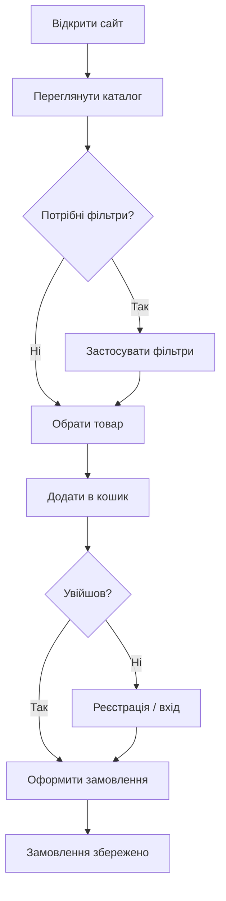

# Business Requirements Document (BRD)

## Alcohol Store — інтернет-магазин алкогольних напоїв

| Реквізит     | Значення                             |
| ------------ | ------------------------------------ |
| **Документ** | Business Requirements Document (BRD) |
| **Проєкт**   | Alcohol Store                        |
| **Версія**   | 1.1                                  |
| **Дата**     | 2026                                 |
| **Автор**    | Степанчук Павло Анатолійович         |

---

## 1. Резюме для керівництва

**Alcohol Store** — вебсервіс для демонстрації онлайн-продажу алкогольних напоїв: клієнт переглядає асортимент, обирає товари, оформлює замовлення після реєстрації; адміністратор підтримує актуальність каталогу.

Документ фіксує **бізнес-цілі**, **зацікавлені сторони**, **бізнес-вимоги** та **правила**, незалежно від технічної реалізації.

---

## 2. Бізнес-контекст

### 2.1. Проблема

Покупцю потрібен зручний цифровий канал для:

- швидкого пошуку напою за брендом, типом, країною, ціною;
- перегляду характеристик (об'єм, міцність, опис);
- оформлення замовлення без візиту до фізичного магазину.

### 2.2. Бізнес-цілі

| ID  | Ціль                                            | Показник успіху                                        |
| --- | ----------------------------------------------- | ------------------------------------------------------ |
| BG1 | Збільшити охоплення клієнтів через онлайн-канал | Користувач може пройти шлях від каталогу до замовлення |
| BG2 | Спростити підбір товару                         | Наявні фільтри та сортування в каталозі                |
| BG3 | Забезпечити облік покупців                      | Реєстрація, історія замовлень у профілі                |
| BG4 | Дати можливість керувати асортиментом           | Адміністратор видаляє неактуальні позиції              |

### 2.3. Зацікавлені сторони

**Таблиця 1 — Stakeholders**

| Роль                   | Інтерес            | Очікування                                |
| ---------------------- | ------------------ | ----------------------------------------- |
| Покупець               | Купити напій       | Зручний каталог, кошик, швидке оформлення |
| Адміністратор магазину | Актуальний каталог | Можливість прибрати товар з продажу       |
| Власник бізнесу        | Продажі, дані      | Збереження замовлень у системі            |
| Розробник              | Реалізація         | Чіткі бізнес-правила та сценарії          |

---

## 3. Обсяг проєкту

### 3.1. В обсязі (In Scope)

- Каталог товарів з фільтрами та сортуванням;
- Пошук за брендом;
- Кошик та оформлення замовлення;
- Реєстрація та вхід;
- Особистий кабінет (профіль, історія замовлень);
- Роль адміністратора (видалення товарів);
- Демонстраційне наповнення каталогу (seed).

### 3.2. Поза обсягом (Out of Scope)

- Онлайн-оплата (картка, LiqPay тощо);
- Доставка та логістика;
- Перевірка віку покупця на рівні державних реєстрів;
- Мобільний нативний додаток;
- Складський облік та постачальники.

---

## 4. Бізнес-вимоги

**Таблиця 2 — Business Requirements**

| ID    | Вимога                | Пріоритет | Опис                                                    |
| ----- | --------------------- | --------- | ------------------------------------------------------- |
| BR-01 | Каталог               | Високий   | Користувач бачить список напоїв із ціною, фото, країною |
| BR-02 | Фільтрація            | Високий   | Фільтр за типом, об'ємом, країною, міцністю             |
| BR-03 | Сортування            | Середній  | Сортування за ціною та популярністю                     |
| BR-04 | Пошук                 | Високий   | Пошук товарів за назвою бренду                          |
| BR-05 | Картка товару         | Високий   | Детальний опис, характеристики, додавання в кошик       |
| BR-06 | Кошик                 | Високий   | Додавання кількох позицій перед оформленням             |
| BR-07 | Реєстрація            | Високий   | Створення облікового запису (ім'я, email, пароль)       |
| BR-08 | Авторизація           | Високий   | Вхід з email і паролем                                  |
| BR-09 | Оформлення замовлення | Високий   | Збереження замовлення та позицій у системі              |
| BR-10 | Історія замовлень     | Середній  | Перегляд минулих замовлень у профілі                    |
| BR-11 | Редагування профілю   | Середній  | Зміна імені, email, пароля                              |
| BR-12 | Адміністрування       | Низький   | Видалення товару з каталогу (роль Admin)                |

---

## 5. Бізнес-правила

**Таблиця 3 — Business Rules**

| ID     | Правило                                                                         |
| ------ | ------------------------------------------------------------------------------- |
| BRU-01 | Оформити замовлення може лише авторизований користувач                          |
| BRU-02 | Email облікового запису має бути унікальним                                     |
| BRU-03 | Ціна позиції в замовленні фіксується на момент покупки (поле `price` у позиції) |
| BRU-04 | Адміністратор призначається вручну в базі даних (роль `Admin`)                  |
| BRU-05 | Товар має містити тип напою, країну, об'єм, міцність, ціну та опис              |
| BRU-06 | Для демонстрації продажу не перевіряється вік покупця в системі                 |

---

## 6. Бізнес-процеси (сценарії)

### 6.1. Процес «Покупка напою»

### 6.2. Процес «Підтримка каталогу (адмін)»

1. Адміністратор входить під обліковим записом з роллю `Admin`.
2. Переглядає каталог.
3. Видаляє неактуальний товар.
4. Клієнти більше не бачать цю позицію в каталозі.

---

## 7. Вимоги до даних (бізнес-рівень)

| Сутність           | Бізнес-опис        | Ключові атрибути                          |
| ------------------ | ------------------ | ----------------------------------------- |
| Клієнт             | Покупець магазину  | Ім'я, прізвище, email                     |
| Товар              | Алкогольний напій  | Бренд, тип, країна, об'єм, міцність, ціна |
| Замовлення         | Покупка клієнта    | Дата, сума, покупець                      |
| Позиція замовлення | Рядок у замовленні | Товар, кількість, ціна за одиницю         |

---

## 8. Припущення та залежності

| Тип        | Опис                                                     |
| ---------- | -------------------------------------------------------- |
| Припущення | Користувач має доступ до інтернету та сучасного браузера |
| Припущення | Асортимент наповнюється адміністратором або seed-даними  |
| Залежність | Працездатність залежить від сервера API та БД            |
| Залежність | Зображення товарів надаються окремими файлами            |

---

## 9. Ризики (бізнес)

| Ризик              | Вплив                      | Пом'якшення                         |
| ------------------ | -------------------------- | ----------------------------------- |
| Відсутність оплати | Неможливий реальний продаж | Вказати в обсязі: демо-проєкт       |
| Порожній каталог   | Поганий UX                 | Скрипт seed при розгортанні         |
| Втрата кошика      | Незавершена покупка        | Повідомлення про необхідність входу |

Технічні та проєктні ризики — у **[RISK_MATRIX.md](./RISK_MATRIX.md)**; узгодження з архітектурою — **[SSD.md](./SSD.md)** (розділ 8).

---

## 10. Критерії приймання (бізнес)

1. Неавторизований відвідувач переглядає каталог і застосовує фільтри.
2. Користувач реєструється, входить, додає товари в кошик і оформлює замовлення.
3. У профілі відображається створене замовлення.
4. Адміністратор видаляє товар — він зникає з каталогу.

---

## 11. Зв'язок з технічною документацією

Бізнес-вимоги BR-01–BR-12 реалізуються технічно згідно **System Specification Document** (`SSD.md`) та REST API (див. `API_POSTMAN.md`).

---

## 12. Історія змін

| Версія | Дата | Опис                        |
| ------ | ---- | --------------------------- |
| 1.0    | 2026 | Початкова версія BRD        |
| 1.1    | 2026 | Посилання на RISK_MATRIX.md |

---

*Кінець документа BRD.*