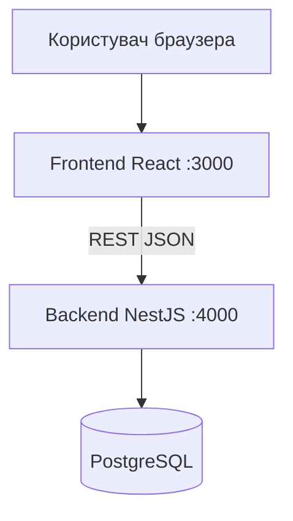
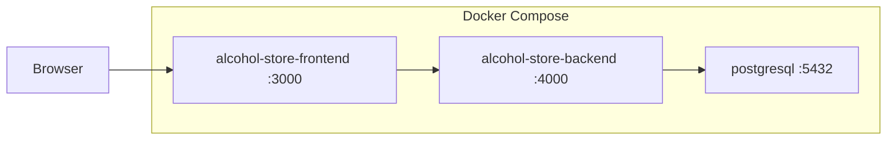
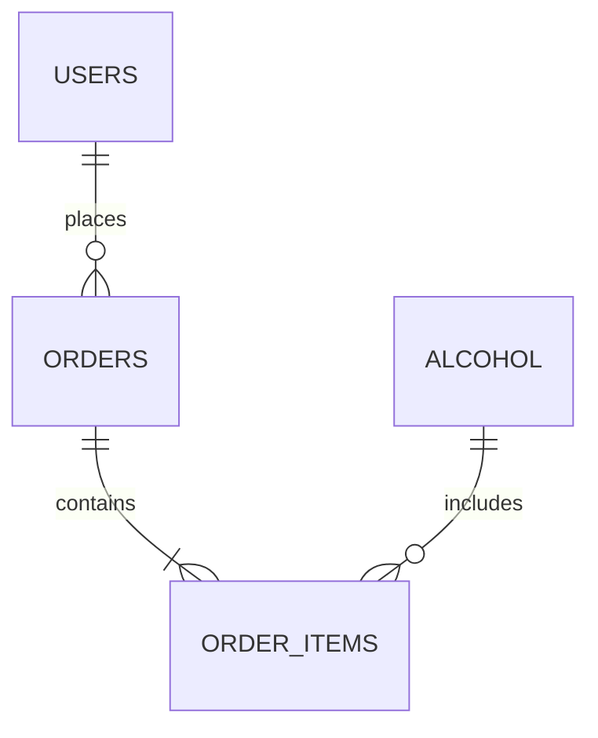

# System Specification Document (SSD)

## Alcohol Store — інтернет-магазин алкогольних напоїв

| Реквізит     | Значення                            |
| ------------ | ----------------------------------- |
| **Документ** | System Specification Document (SSD) |
| **Система**  | Alcohol Store                       |
| **Версія**   | 1.1                                 |
| **Дата**     | 2026                                |
| **Автор**    | Степанчук Павло Анатолійович        |

---

## 1. Вступ

### 1.1. Мета документа

Цей документ описує **технічну специфікацію** програмного комплексу Alcohol Store: призначення, архітектуру, компоненти, модель даних, інтерфейси та нефункціональні вимоги. Документ призначений для розробників, тестувальників та викладача з дисципліни документування ПЗ.

### 1.2. Область застосування

Система — вебзастосунок електронної комерції (навчальний проєкт): каталог напоїв, кошик, реєстрація, замовлення, адміністрування товарів.

### 1.3. Терміни та скорочення

| Термін | Визначення                          |
| ------ | ----------------------------------- |
| API    | Програмний інтерфейс додатку (REST) |
| SPA    | Односторінковий вебзастосунок       |
| JWT    | JSON Web Token для авторизації      |
| ORM    | Object-Relational Mapping (TypeORM) |
| SSD    | System Specification Document       |

---

## 2. Огляд системи

### 2.1. Призначення

Автоматизувати для користувача: перегляд каталогу з фільтрами, пошук, оформлення замовлення; для адміністратора — видалення товарів.

### 2.2. Користувачі системи

| Актор                 | Опис                                    |
| --------------------- | --------------------------------------- |
| Гість                 | Перегляд каталогу без входу             |
| Користувач (User)     | Реєстрація, кошик, замовлення, профіль  |
| Адміністратор (Admin) | Керування каталогом (видалення товарів) |

### 2.3. Контекст системи

---

## 3. Функціональна специфікація

### 3.1. Модулі системи

**Таблиця 1 — Модулі та відповідальність**

| ID  | Модуль      | Компонент               | Функції                                           |
| --- | ----------- | ----------------------- | ------------------------------------------------- |
| M1  | Каталог     | `alcohol`               | CRUD напоїв, фільтрація, статичні файли           |
| M2  | Користувачі | `users`, `auth`         | Реєстрація, вхід, JWT, профіль                    |
| M3  | Замовлення  | `orders`, `order-items` | Створення замовлення та позицій                   |
| M4  | UI          | `frontend`              | Відображення, кошик (localStorage), маршрутизація |

### 3.2. Вимоги до функцій (технічний рівень)

| ID  | Вимога                                                            | Реалізація                                            |
| --- | ----------------------------------------------------------------- | ----------------------------------------------------- |
| F1  | Фільтрація каталогу за типом, країною, об'ємом, міцністю, брендом | `GET /alcohol/filter`, query-параметри                |
| F2  | Авторизація користувача                                           | `POST /auth/login`, JWT у заголовку                   |
| F3  | Захист операцій замовлення                                        | `AuthGuard` на `POST /orders`, `GET /orders/user/:id` |
| F4  | Зберігання фото товарів                                           | `multer` → `backend/uploads/`, поле `file`            |
| F5  | Початкове наповнення БД                                           | `backend/scripts/seed-alcohol.js`                     |

---

## 4. Архітектура

### 4.1. Стиль архітектури

Трирівнева клієнт–серверна архітектура:

1. **Presentation** — React SPA;
2. **Application** — NestJS (модулі, сервіси, контролери);
3. **Data** — PostgreSQL через TypeORM.

### 4.2. Технологічний стек

| Шар    | Технологія                      | Версія / примітка |
| ------ | ------------------------------- | ----------------- |
| UI     | React, Ant Design, React Router | CRA               |
| API    | NestJS                          | JavaScript        |
| БД     | PostgreSQL                      | 16 (Docker)       |
| Auth   | @nestjs/jwt, bcrypt             | Bearer token      |
| Deploy | Docker Compose                  | 3 сервіси         |

### 4.3. Діаграма розгортання

---

## 5. Специфікація даних

### 5.1. Логічна модель

Сутності: **User**, **Alcohol**, **Order**, **OrderItem**.

### 5.2. Таблиці (фізичний рівень)

**users:** `id`, `first_name`, `last_name`, `email`, `password`, `role`  
**alcohol:** `id`, `item_code`, `brand`, `countries`, `type_alcohol`, `volume`, `durability`, `availability`, `cost`, `description`, `file`  
**orders:** `id`, `userId`, `total_price`, `created_at`  
**orderItems:** `id`, `alcoholId`, `orderId`, `quantity`, `price`

### 5.3. Правила цілісності

- `email` унікальний;
- `item_code` (UUID) унікальний, генерується автоматично;
- FK `userId`, `alcoholId`, `orderId` обов'язкові;
- при видаленні alcohol — каскад для `orderItems` (згідно entity).

---

## 6. Специфікація інтерфейсів

### 6.1. Зовнішній REST API

- **Базовий URL:** `http://localhost:4000`
- **Формат:** JSON; для завантаження файлів — `multipart/form-data`
- **Авторизація:** `Authorization: Bearer <JWT>`

Детальний опис двох ключових endpoint — у файлі `API_POSTMAN.md` та колекції Postman.

### 6.2. Користувацький інтерфейс

| Маршрут            | Компонент | Призначення                  |
| ------------------ | --------- | ---------------------------- |
| `/`                | Home      | Головна                      |
| `/catalog`         | Catalog   | Каталог, фільтри, сортування |
| `/catalog/product` | Product   | Картка товару                |
| `/auth`            | Auth      | Вхід / реєстрація            |
| `/profile`         | Profile   | Профіль, замовлення          |

---

## 7. Нефункціональні вимоги

**Таблиця 2 — NFR**

| ID   | Категорія       | Вимога                                                |
| ---- | --------------- | ----------------------------------------------------- |
| NFR1 | Продуктивність  | Відповідь API каталогу < 2 с на локальному середовищі |
| NFR2 | Безпека         | Паролі — bcrypt; JWT для захищених маршрутів          |
| NFR3 | Масштабованість | Модульна структура NestJS (окремі модулі)             |
| NFR4 | Супровідність   | Docker Compose для відтворюваного запуску             |
| NFR5 | Локалізація UI  | Українська мова інтерфейсу                            |

---

## 8. Управління ризиками

Проєктні, технічні та експлуатаційні ризики ідентифіковані та оцінені за шкалою ймовірності й впливу; для кожного визначені заходи пом’якшення. Бізнес-ризики (оплата, каталог, кошик) узгоджені з [BRD.md](./BRD.md) (розділ 9).

**Повна матриця ризиків:** [RISK_MATRIX.md](./RISK_MATRIX.md).

---

## 9. Обмеження та припущення

| Тип        | Опис                                                      |
| ---------- | --------------------------------------------------------- |
| Обмеження  | `synchronize: true` — лише для навчального середовища     |
| Обмеження  | Кошик у `localStorage`, не синхронізується між пристроями |
| Припущення | Користувач має Docker Desktop для запуску                 |
| Припущення | PostgreSQL доступна через мережу Docker                   |

---

## 10. Критерії приймання (технічні)

1. `docker compose up --build` піднімає frontend, backend, postgres без помилок.
2. `npm run seed` у контейнері backend заповнює каталог.
3. `GET /alcohol/filter` повертає відфільтрований JSON.
4. `POST /auth/login` повертає `accessToken`.
5. Авторизований користувач створює замовлення через `POST /orders`.

---

## 11. Історія змін

| Версія | Дата | Опис                                                    |
| ------ | ---- | ------------------------------------------------------- |
| 1.0    | 2026 | Початкова версія SSD                                    |
| 1.1    | 2026 | Розділ управління ризиками, посилання на RISK_MATRIX.md |

---

*Кінець документа SSD.*